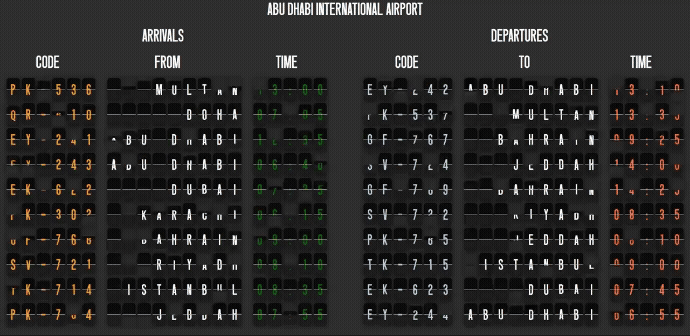

# ✈️ Split Flap Display — HTML, CSS & JavaScript  
A retro-styled **Split Flap Display** inspired by classic airport arrival/departure boards.  
Built using **vanilla JavaScript**, dynamic DOM generation, randomized animations, and clean modular code.

This project is part of a YouTube series where we recreate the nostalgic flipping effect seen in mechanical information boards — starting from simple flaps, evolving into full airport-style schedules.

---

## 🎥 Demo  


---

## 📌 Features

### ✅ Dynamic Split Flap Rows  
- Each row displays **Arrivals** and **Departures**  
- Flight code, location, and time rendered as animated flaps  
- Automatic padding for alignment  

### ✅ Realistic Flip Animation  
- Separate **top** and **bottom** flap animations  
- Uses CSS `@keyframes` + JS to restart animations  
- Randomized delays for natural mechanical feel  

### ✅ Randomized Flight Schedule  
- Data lists for **Arrivals** and **Departures**  
- Random subset of rows displayed each cycle  
- Fully modular generation of flap components  

### ✅ Visibility Toggle  
- Periodic visibility on/off for extra realism  
- Mimics momentary mechanical “flicker”

---

## 📂 Project Structure

```
Split-Flap-Display/
│
├── images/
│   └── screen-cast.gif      # demo animation
│
├── index.html               # main UI structure
├── style.css                # layout + animations
├── script.js                # full JavaScript logic
└── README.md                # documentation
```

---

## ⚙️ Usage

### Clone the repository:
```bash
git clone https://github.com/mni007nomi/Split-Flap-Display
```

### Open the project:
Simply open `index.html` in a browser — no build steps required.

---

## 🧠 JavaScript Highlights

### 🔸 Generate flaps programmatically  
Every character of the schedule (flight codes, locations, times) is turned into a 2-piece flap:

```js
addFlap(parent, character, color)
```

### 🔸 Restart animations cleanly  
Force a reflow to retrigger CSS animations on demand:

```js
function restartAnimation(element, anim) {
  element.style.animation = "none"
  void element.offsetWidth
  element.style.animation = anim
}
```

### 🔸 Randomized flip timing  
Adds realism by avoiding synchronized flips:

```js
const randomDelay = Math.random() * 1000
setTimeout(() => {
  restartAnimation(item, "flip-top var(--animation-timing) ease-in")
}, randomDelay)
```

---

## 🚀 Planned Enhancements

- Smooth transition for text changes (character sequencing)
- Live API-driven flight data
- Themes (night mode, neon, amber LCD)
- Sound effects for mechanical “clack”
- Mobile responsive layout

---

## 🎬 Credits & Inspiration

This project draws inspiration from real Split Flap Displays seen in airports, especially this fantastic real-time recording from Frankfurt Airport:

**YouTube Video:**  
https://www.youtube.com/watch?v=cj32w5z81Ak

---

## 🤝 Contributing

Pull requests are welcome!  
If you'd like to improve animations, add themes, or optimize performance — feel free to open an issue.

---

## ⭐ Support

If you enjoy this project, please consider:

- ⭐ starring the repo  
- 📺 following the YouTube series
[YouTube Playlist](https://www.youtube.com/playlist?list=PLh8tSCp2f8ek84gP0feP83ScEXVgnnHBp)
- 💬 sharing feedback or ideas  

---

Enjoy the satisfying *clack-clack-clack* of digital flaps! 😄